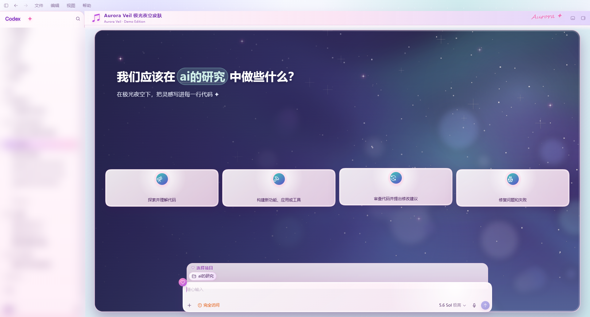
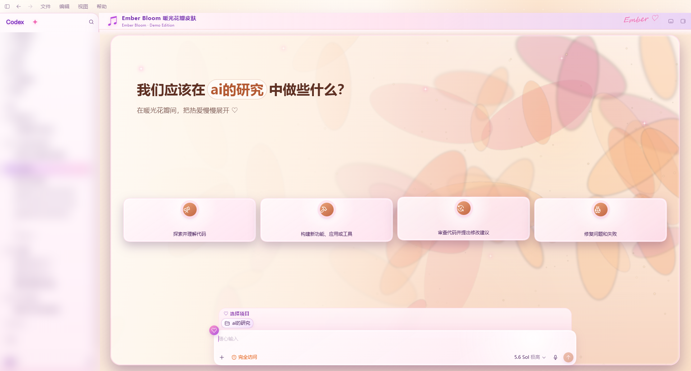
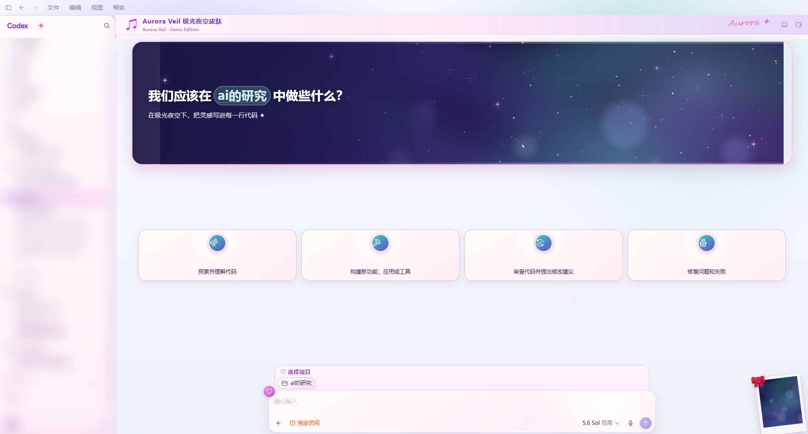
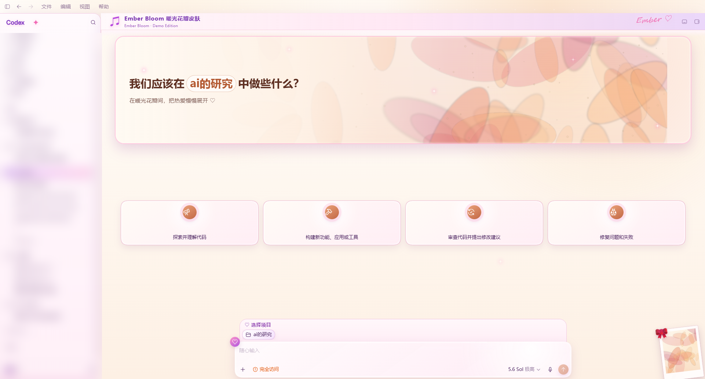

# Codex Dream Skin

**发一张图给你的 Codex，它自己给自己换肤。**

这是一个 Windows Codex 桌面端的换肤引擎：不改任何应用文件，通过 Chromium DevTools Protocol（CDP）把皮肤"注入"到官方渲染器里，随时一键还原。主题是纯数据（一个文件夹：`theme.json` + 一张图），配套的 [THEME-SPEC.md](THEME-SPEC.md) 是写给 AI agent 读的定制规范——把这个仓库和一张图丢给你的 Codex / Claude，它就能照着规范给你产出一套新主题。

| Aurora Veil（内置 demo） | Ember Bloom（内置 demo） |
|---|---|
|  |  |
|  |  |

> 两个内置主题的视觉图都是 `tools/generate-demo-art.py` 程序化生成的原创图片（固定种子，可复现），仓库不含任何真人照片。

## 安装（一句话版）

把整个仓库（或 zip）给你自己的 Codex / Claude agent，说：**"安装这个皮肤"**。

手动版（PowerShell，需要 Node.js ≥ 20）：

```powershell
scripts\install-dream-skin.ps1        # 一次性：写入配套的官方浅色主题、创建快捷方式和自恢复守护
scripts\start-dream-skin.ps1          # 启动带调试端口的 Codex 并注入皮肤
scripts\verify-dream-skin.ps1 -ScreenshotPath shot.png   # 验证 + 截图
```

切换主题 / 版式（皮肤没有屏幕上的切换按钮，一切交给 agent）：

```powershell
node scripts\set-theme.mjs --list                 # 看有哪些主题
node scripts\set-theme.mjs aurora-veil fullscreen # 切主题 + 版式，选择自动持久化
```

## 工作原理

- **CDP 注入**：以 `--remote-debugging-port=9335` 启动 Store 版官方 `ChatGPT.exe`，通过 DevTools 协议往主渲染器注入一段 CSS + JS。**不修改、不替换任何应用文件**，不碰 `WindowsApps`、不碰 `app.asar`，登录态/会话/插件全部保持原样。
- **manifest 驱动**：注入器启动时扫描 `themes/`（公开）与 `themes-private/`（本地私有，已 gitignore）下所有含 `theme.json` 的文件夹，动态生成主题变量块、校验每个主题的 `extra.css` 作用域、把图片打包进注入载荷。加主题不用改一行引擎代码。
- **随时可还原**：`scripts\restore-dream-skin.ps1` 现场移除所有注入内容，DOM 恢复得干干净净；加 `-Uninstall -RestoreBaseTheme` 连快捷方式和安装前的配色备份一起还原。
- **自恢复**：一个隐藏 watcher 在正常重启 Codex 后自动补皮肤（带防抖、频率熔断、失败冷却，不会跟应用打架；详见 `references/runtime-notes.md`）。
- **辅助窗口保护**：桌面宠物等 `initialRoute` 辅助渲染器永远不注入、保持透明。

## 用 agent 定制你自己的主题

1. 挑一张图（自己的插画、生成图、壁纸——注意版权与肖像权，见下）；
2. 把图 + 这个仓库给你的 agent，说"照着 THEME-SPEC.md 做一个主题"；
3. agent 会产出 `themes/<名字>/theme.json + art.png`（必要时带 `extra.css`），自己截图迭代 crop，然后 `node scripts/set-theme.mjs <名字>` 给你看效果。

规范里包含：28 个取色 token 的逐个说明、四种画面角色的裁剪调参流程、"干净图 vs 带界面文字的截图"决策树（后者有现成的高斯模糊柔焦模板）、验收清单。

## 卸载

```powershell
scripts\restore-dream-skin.ps1 -Uninstall -RestoreBaseTheme
```

之后正常启动 Codex 即为纯官方状态。所有运行时状态都在 `%LOCALAPPDATA%\CodexDreamSkin`，删掉即无痕。

## 免责声明

- 装饰性项目，与 OpenAI 无关。Codex 桌面端更新可能改变内部 DOM 结构，届时需要重新适配（引擎按语义选择器定位，小更新通常无感）。
- CDP 端口只绑定本机回环（9335），不要将其暴露到局域网。
- **请勿使用真人明星肖像制作并公开传播主题**；`themes-private/` 的存在就是为了把私人主题留在本地。

---

## English (short version)

**Send one image to your Codex, and it reskins itself.**

A manifest-driven skin engine for the Windows Codex desktop app. It injects CSS/JS into the official renderer over the Chrome DevTools Protocol — no app files are modified, fully reversible, login/session untouched. Themes are pure data folders (`theme.json` + one image); [THEME-SPEC.md](THEME-SPEC.md) is an agent-readable spec, so your Codex/Claude agent can produce a complete theme from a single picture.

- Install: hand this repo to your agent and say "install this skin", or run `scripts\install-dream-skin.ps1` then `scripts\start-dream-skin.ps1` (needs Node.js ≥ 20, PowerShell).
- Switch themes: `node scripts\set-theme.mjs --list` / `node scripts\set-theme.mjs aurora-veil fullscreen` (no on-screen switcher by design — agents drive it).
- Uninstall: `scripts\restore-dream-skin.ps1 -Uninstall -RestoreBaseTheme`.
- Bundled demo art is 100% procedurally generated (`tools/generate-demo-art.py`), no photos of real people in this repo. Do not publish themes using a real person's likeness; keep private themes in the git-ignored `themes-private/`.
- Decorative project, not affiliated with OpenAI. A Codex update may require re-adaptation.
